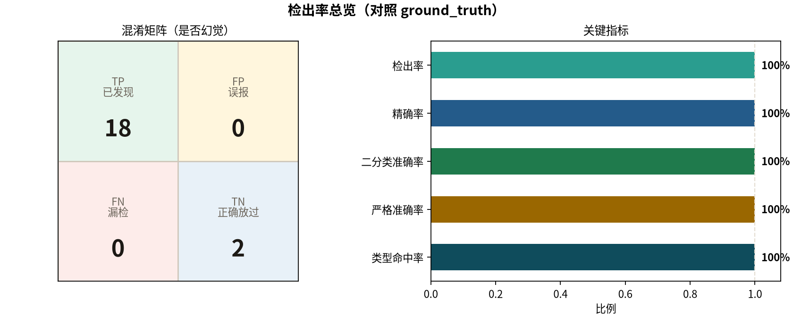

# 客服回复幻觉检测（0110）

对照任务：自定义幻觉分类 → 自动化检测 20 条回复 → 对照 `ground_truth` 验检出率（漏检/误报）→ 分析误判 → README 说明。

技术栈：**Chroma**（向量库）+ **LangGraph**（检索→判定）+ **DeepSeek**（判定 LLM）。

## 1. 幻觉分类体系

**判定原则（什么算幻觉）**：以知识库为唯一事实源。客服回复中出现与知识库矛盾、知识库明确否定、或系统明确不具备的能力/信息，即视为幻觉；与知识库一致、或仅列举知识库子集且结论正确，不算幻觉。

| 类型   | 严重程度     | 定义                |
| ---- | -------- | ----------------- |
| 安全误导 | critical | 健康/安全建议与知识相悖或过度保证 |
| 政策编造 | high     | 核心业务政策被杜撰/大幅放宽    |
| 参数编造 | high     | 产品规格/材质/功能等被篡改    |
| 优惠编造 | high     | 不存在的优惠券/折扣        |
| 信息编造 | high     | 地址/门店/品牌关系等事实杜撰   |
| 能力越界 | high     | 假装具备未接入的查询/操作能力   |
| 政策偏差 | medium   | 政策部分正确但细节错误       |
| 信息遗漏 | low      | 省略关键约束后给出误导结论     |

实现见 `kb/taxonomy.py`（含定义、严重程度分值、示例）。附件 `ground_truth` 中出现的类型均落在上述 8 类内。

## 2. 检测方法

对附件 **20 条**回复逐条自动检测并落盘标注（真实 LLM API，非 mock）：

```text
knowledge_base ──► Embedding ──► Chroma
user_question + reply ──► Top-K 检索 ──► LangGraph judge(DeepSeek) ──► JSON 标注
```

| 步骤  | 说明                                         |
| --- | ------------------------------------------ |
| 建索引 | `knowledge_base` 写入 Chroma                 |
| 检索  | 用「问题 + 回复摘要」做 Top-K 相似度检索                  |
| 判定  | DeepSeek 仅依据检索上下文输出：是否幻觉、类型、严重度、证据         |
| 落盘  | `output/detection_results_rag.json`（20 条全量标注） |

## 3. 检出率验证（vs ground_truth）

以下指标由最近一次 `main.py` 对照 `ground_truth` 自动生成。



|  | 预测：幻觉 | 预测：正常 |
| --- | ---: | ---: |
| **实际：幻觉** | TP **18** | FN **0** |
| **实际：正常** | FP **0** | TN **2** |

| 指标 | 数值 | 说明 |
| ---- | ---- | ---- |
| 检出率 (Recall) | **100.0%** | 有问题的是否都被发现 |
| 精确率 | **100.0%** | 报出来的是否冤枉好人 |
| 二分类准确率 | **100.0%** | 只看「是否幻觉」 |
| 严格准确率 | **100.0%** | 是否幻觉 + 类型都对 |
| 类型命中率 | **100.0%** | 已检出样本中类型一致比例 |

- **漏检 (FN=0)**：无
- **误报 (FP=0)**：无
- **类型识别错误（0）**：无
- 对应知识出现在 Top-K：20/20

详细 JSON：[`output/evaluation_report_rag.json`](output/evaluation_report_rag.json)；HTML：[`output/report.html`](output/report.html)。

## 4. 误判原因分析

本轮二分类无漏检/误报，类型也全部识别正确。

> 下方「为何判错」由本轮评测后调用 LLM 生成，非预写文案。

### 二分类错误预测（是否幻觉判错）

| 错误类型 | 数量 | 样本 |
| -------- | ---: | ---- |
| 漏检 (FN) | 0 | 无 |
| 误报 (FP) | 0 | 无 |

### 类型识别错误（是否幻觉对了，类型判错）

本轮无类型识别错误。

## 5. 快速开始

```bash
git clone git@github.com:jinweifan/Knowledge_opt.git
cd Knowledge_opt
uv sync
cp .env.example .env   # 填入 DEEPSEEK_API_KEY

uv run python main.py --top-k 3
# 自动：检测 → 评估 → 图表 / README§3§4 / misjudgment_analysis.md / report.html

uv run python -m cli.build_index
uv run python -m kb.reporting.sync --gold-hits 18/20
uv run python -m kb.reporting.html
```

| 环境变量               | 默认                       |
| ------------------ | ------------------------ |
| `DEEPSEEK_API_KEY` | 必填                       |
| `DEEPSEEK_MODEL`   | `deepseek-chat`          |
| `EMBEDDING_MODEL`  | `BAAI/bge-small-zh-v1.5` |

## 6. AI 工具使用情况

| 用途           | 选型                                          |
| ------------ | ------------------------------------------- |
| 向量库          | Chroma                                      |
| 编排 / 模型调用    | LangGraph + LangChain（OpenAI 兼容 → DeepSeek） |
| Embedding    | BAAI/bge-small-zh-v1.5                      |
| 判定 LLM       | DeepSeek Chat API（真实调用）                     |
| 业务评测         | `data/ground_truth.json`                    |
| 开发辅助         | uv + Ruff；[Superpowers](https://github.com/obra/superpowers) 工作流插件 |

## 7. 项目结构

```text
main.py                 # 主入口（薄封装 → cli.detect）
kb/                     # 领域能力
  taxonomy.py           # 幻觉分类体系
  paths.py              # 路径常量
  prompts/              # 判定提示词
  pipeline/             # 索引 / LangGraph / LLM
  evaluation/           # 标准答案评测（漏检/误报/类型）
  reporting/            # HTML / 图表 / README 同步
cli/                    # 辅助命令（detect / build_index）
data/                   # replies.json + ground_truth.json（各 20 条）
output/                 # 检测结果、评测报告、HTML
docs/screenshots/       # 交付截图
```

**评测口径**：

- **二分类（是否幻觉）**：漏检=FN，误报=FP；类型判错仍记为 TP。
- **严格准确率**：是否幻觉 **且** 类型都对；类型识别错误计入扣分。
